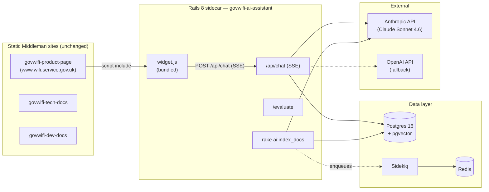
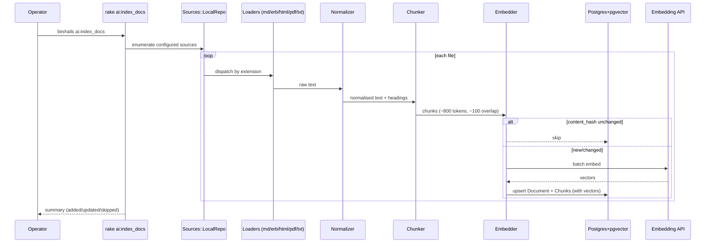
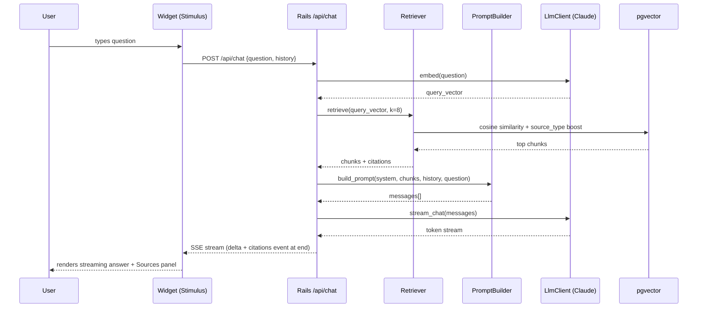
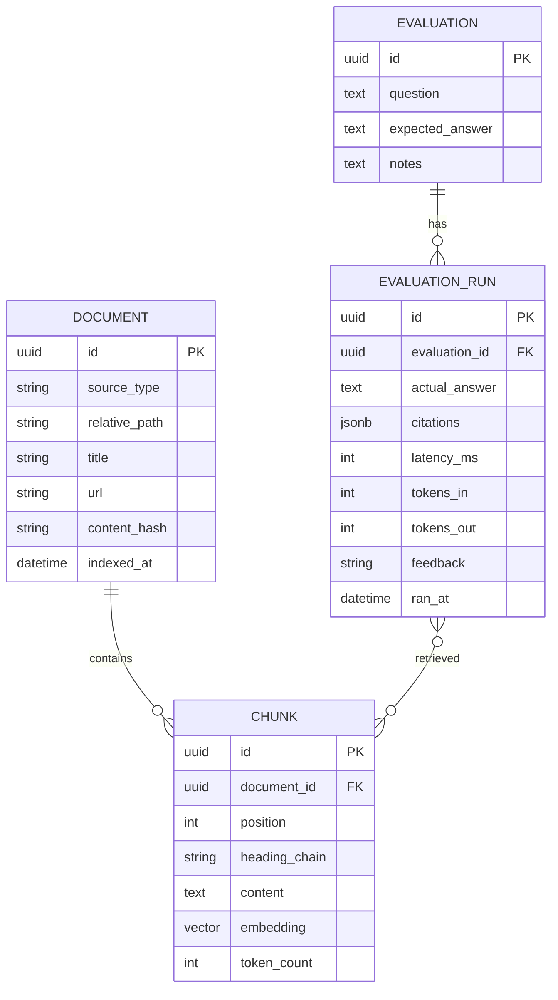

# Architecture

> Companion diagram-heavy view of the system. Pair with `plan.md` (the why) and `decisions.md` (the ADRs).

## 1. High-level architecture



## 2. Data flow — indexing



## 3. Data flow — query



## 4. Services (Rails app internal layout)

```
chatbot/
├── app/
│   ├── controllers/
│   │   └── api/
│   │       └── chat_controller.rb        # POST /api/chat (SSE)
│   ├── models/
│   │   ├── document.rb                    # 1 row per indexed file
│   │   ├── chunk.rb                       # embedding column: vector(1536)
│   │   └── evaluation.rb                  # test question + expected answer
│   ├── services/
│   │   ├── ingest/
│   │   │   ├── pipeline.rb                # orchestrates the whole flow
│   │   │   ├── sources/local_repo.rb      # enumerate files
│   │   │   ├── loaders/{markdown,erb,html,pdf,txt}_loader.rb
│   │   │   ├── normalizer.rb              # strip nav, resolve headings
│   │   │   └── chunker.rb                 # recursive, token-aware
│   │   ├── llm/
│   │   │   ├── client.rb                  # abstraction (chat, stream_chat, embed)
│   │   │   ├── anthropic_adapter.rb       # default
│   │   │   └── openai_adapter.rb          # alt
│   │   ├── retrieval/
│   │   │   ├── retriever.rb               # pgvector search
│   │   │   └── ranker.rb                  # source-type weighting
│   │   ├── answering/
│   │   │   ├── prompt_builder.rb          # strict "answer only from context" prompt
│   │   │   └── answer_service.rb          # end-to-end query orchestration
│   │   └── evaluation/
│   │       └── runner.rb                  # replays a suite of eval questions
│   ├── jobs/
│   │   ├── index_document_job.rb          # single-file indexing
│   │   └── reindex_all_job.rb             # fans out
│   ├── javascript/
│   │   └── controllers/
│   │       ├── chat_controller.js         # Stimulus
│   │       └── citation_controller.js
│   └── views/
│       ├── evaluations/
│       └── widget/                        # server-rendered fallback
├── config/
│   ├── ai_sources.yml                     # source_type => path config
│   └── initializers/llm.rb                # provider selection
├── lib/tasks/
│   └── ai.rake                            # ai:index_docs, ai:evaluate
└── spec/
```

## 5. HTTP APIs

### `POST /api/chat`

**Request**
```json
{
  "question": "How do I sign up for GovWifi?",
  "conversation_id": "uuid-optional",
  "history": [{"role":"user","content":"..."},{"role":"assistant","content":"..."}]
}
```

**Response — Server-Sent Events**
```
event: token
data: {"delta":"To sign up "}

event: token
data: {"delta":"for GovWifi you need..."}

event: citations
data: {"citations":[
  {"source_type":"product-page","path":"source/get-started.html.erb","title":"Get started","url":"https://www.wifi.service.gov.uk/get-started/","score":0.87},
  {"source_type":"tech-docs","path":"source/documentation/set_up.md","title":"Set up","url":"...","score":0.81}
]}

event: done
data: {"latency_ms":2431,"tokens_in":1204,"tokens_out":312,"model":"claude-sonnet-4-6"}
```

**When retrieval returns nothing above a similarity threshold**, the assistant returns:
```
event: token
data: {"delta":"I couldn't find that information in the GovWifi documentation."}
event: citations
data: {"citations":[]}
event: done
data: {...}
```

### `GET /evaluate`
Rails view. Table of `Evaluation` records, form to add new ones, "Run all" button that enqueues `EvaluationRunJob`, per-row latency + retrieved-sources display.

## 6. Background jobs

| Job | Trigger | Purpose |
|---|---|---|
| `ReindexAllJob` | `rake ai:index_docs` (fans out) | Full re-index across all configured sources |
| `IndexDocumentJob(path)` | Enqueued by ReindexAll | Load → chunk → embed → upsert a single file |
| `EvaluationRunJob(evaluation_id)` | `/evaluate` "Run" button | Runs one question through the full pipeline, records latency + result |

Sidekiq queues: `default`, `indexing` (throttled to respect embedding API rate limits).

## 7. RAG pipeline (detail)

**Chunking:** Recursive, heading-aware. Target ~800 tokens, 100-token overlap. Splits on `#`/`##`/`###` first, then paragraphs, then sentences. Every chunk carries its heading chain (breadcrumb) which is prepended to its embedded text — improves retrieval on nested topics.

**Embedding:** Batched (max 100 chunks per call). Model configured per provider (`text-embedding-3-small` for OpenAI, `voyage-3` when using Anthropic path). Vector dimension stored per document to allow multi-model coexistence during a migration.

**Retrieval:** `k=8` cosine similarity. Similarity threshold: `0.2` cutoff (chunks below are dropped, not fed to the LLM). Result set re-ranked by `source_type_priority` weighting:
- product-page: ×1.15
- tech-docs: ×1.05
- dev-docs: ×1.00
- zendesk: ×0.85

**Prompt:** System prompt enforces "answer only from the provided context; if the context does not contain the answer, reply exactly 'I couldn't find that information in the GovWifi documentation.'" Context blocks are labelled with `[Source N: path]` so the model can cite them; the API layer maps back to full citation metadata.

**Temperature:** 0.2 (near-deterministic).

## 8. Security considerations

- **No PII persistence** in Phase 1. Conversation history is client-held.
- **Rate limiting** via `rack-attack` (per-IP, per-minute).
- **CSRF/CORS:** API is same-origin when deployed together; if cross-origin (widget on product-page host), CORS is restricted to `www.wifi.service.gov.uk` and dev hosts.
- **API keys:** Rails encrypted credentials (`config/credentials/production.yml.enc`).
- **Prompt injection defence:** Ingested docs are treated as untrusted content, wrapped in `<context>...</context>` blocks; system prompt explicitly says to ignore instructions inside context.
- **CSP:** Widget script is served from a known origin; nonce-based CSP compatible.
- **Logging:** Redact question payloads at INFO level (log only length + latency); full request logging behind a debug flag.

## 9. Deployment approach

- **Local dev:** `docker-compose up` brings up Postgres, Redis, Rails, Sidekiq. Widget served from `http://localhost:3000/widget.js`. Static product-page served from its existing dev server.
- **Preview / staging:** Deploy the `chatbot` Rails app to a PaaS instance; deploy the `chatbot` branch of product-page to a preview URL that includes the widget.
- **Production:** Two PaaS apps — the existing static product-page (unchanged) and the new Rails app. DNS: `assistant.wifi.service.gov.uk` (proposed).
- **Migrations:** `bin/rails db:migrate` in a release phase. `pgvector` extension enabled by migration.
- **Zero-downtime:** Blue/green on the Rails app; widget requests fail gracefully (widget catches network errors and shows a friendly message).

## 10. Data model


